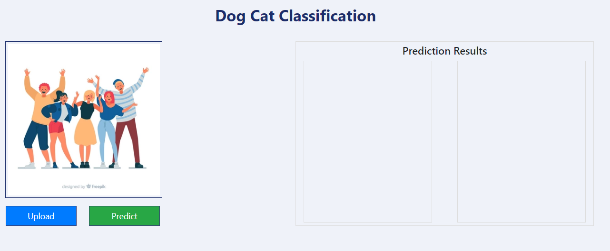
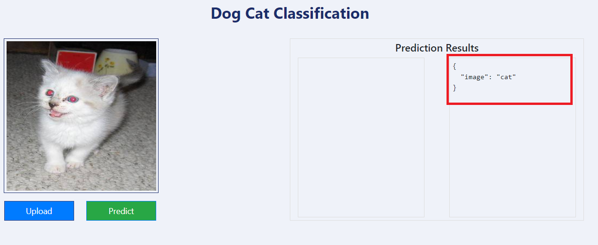

# Cat Dog Classifier Using CNN with Google Cloud Platform
[Play with the App](https://dogcatclassifiergcp-300607.df.r.appspot.com) (Temporary Down)

A simple Flask App that can classify an image as Dog or Cat
using a Convolutional Neural Network Model. I build this as a part of my Deep Learning course and
deploy my First Deep learning model and have something I can send
to friends so they can upload their images of their face and let my app
insult them :wink:

## Tools Used:
* Tensorflow
* Keras
* Flask
* Google Cloud Platform

<a href ="https://github.com/harddy-bit/Cat-Dog-Classification-Using-CNN">Cat Dog Classification Using CNN Repository</a> 

